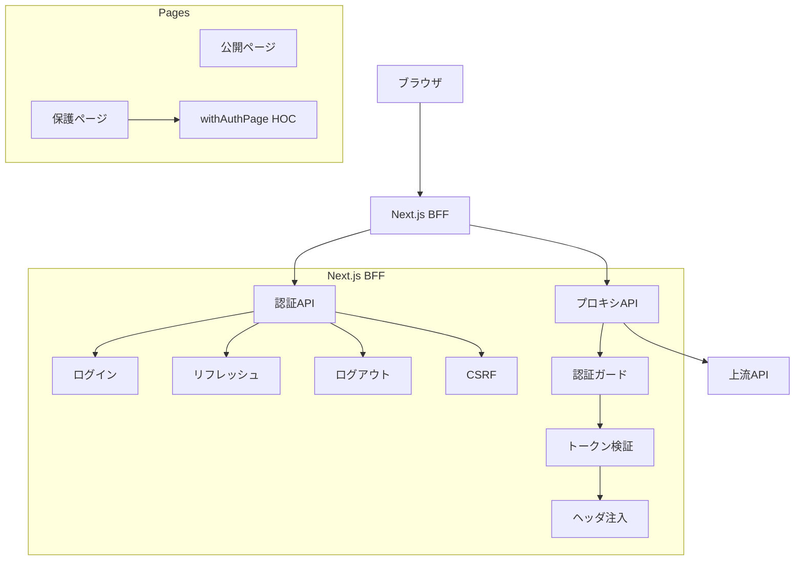

# 設計文書

## 概要

Next.js Pages RouterベースのBFF（Backend-for-Frontend）パターンを使用したCookieベース認証システムの設計です。このシステムは、OWASP ASVS L2セキュリティ標準に準拠し、XSSやCSRF攻撃から保護された安全な認証機能を提供します。

### 設計原則
- **セキュリティファースト**: すべてのトークンをHTTP-onlyクッキーで管理
- **BFFパターン**: 純粋なプロキシとして動作し、ビジネスロジックを含まない
- **段階的実装**: フェーズごとに機能を構築し、各段階で検証可能
- **保守性**: テスト可能で拡張しやすいアーキテクチャ

## アーキテクチャ

### システム構成図



### レイヤー構成

1. **プレゼンテーション層**
   - 公開ページ（認証不要）
   - 保護ページ（withAuthPage HOCでラップ）
   - ログイン/ログアウトUI

2. **BFF層**
   - 認証エンドポイント（/api/auth/*）
   - プロキシエンドポイント（/api/proxy/*）
   - セッション管理ユーティリティ

3. **統合層**
   - 上流API通信
   - トークン管理
   - エラーハンドリング

## コンポーネントとインターフェース

### 認証コンポーネント

#### AuthService
```typescript
interface AuthService {
  login(credentials: LoginCredentials): Promise<AuthResult>
  refresh(): Promise<AuthResult>
  logout(): Promise<void>
  validateSession(token: string): Promise<SessionInfo>
}
```

#### CookieManager
```typescript
interface CookieManager {
  setAuthCookies(tokens: AuthTokens): void
  clearAuthCookies(): void
  getAccessToken(): string | null
  getRefreshToken(): string | null
  getCSRFToken(): string | null
}
```

#### SessionGuard
```typescript
interface SessionGuard {
  requireAuth(handler: NextApiHandler): NextApiHandler
  withAuthPage<P>(Component: NextPage<P>): NextPage<P>
  getSession(context: GetServerSidePropsContext): Promise<Session | null>
}
```

### プロキシコンポーネント

#### APIProxy
```typescript
interface APIProxy {
  forward(request: ProxyRequest): Promise<ProxyResponse>
  injectAuthHeaders(headers: Headers, token: string): Headers
  handleUpstreamError(error: UpstreamError): ProxyResponse
}
```

#### RetryHandler
```typescript
interface RetryHandler {
  handleTokenExpiry(request: ProxyRequest): Promise<ProxyResponse>
  attemptRefresh(): Promise<boolean>
  shouldRetry(error: Error): boolean
}
```

### クライアントコンポーネント

#### AuthContext
```typescript
interface AuthContextValue {
  user: User | null
  isLoading: boolean
  login: (credentials: LoginCredentials) => Promise<void>
  logout: () => Promise<void>
  refreshSession: () => Promise<void>
}
```

#### APIClient
```typescript
interface APIClient {
  get<T>(url: string): Promise<T>
  post<T>(url: string, data: any): Promise<T>
  put<T>(url: string, data: any): Promise<T>
  delete<T>(url: string): Promise<T>
}
```

## データモデル

### 認証関連モデル

```typescript
interface AuthTokens {
  accessToken: string
  refreshToken: string
  csrfToken: string
}

interface LoginCredentials {
  email: string
  password: string
}

interface User {
  id: string
  email: string
  name: string
  roles: string[]
}

interface Session {
  user: User
  expiresAt: Date
  csrfToken: string
}

interface AuthResult {
  success: boolean
  user?: User
  error?: string
}
```

### Cookie設定モデル

```typescript
interface CookieConfig {
  name: string
  path: string
  maxAge: number
  httpOnly: boolean
  secure: boolean
  sameSite: 'strict' | 'lax' | 'none'
}

const COOKIE_CONFIGS: Record<string, CookieConfig> = {
  accessToken: {
    name: 'at',
    path: '/',
    maxAge: 15 * 60, // 15分
    httpOnly: true,
    secure: true,
    sameSite: 'lax'
  },
  refreshToken: {
    name: 'rt',
    path: '/api',
    maxAge: 7 * 24 * 60 * 60, // 7日
    httpOnly: true,
    secure: true,
    sameSite: 'strict'
  },
  csrfToken: {
    name: 'csrf',
    path: '/',
    maxAge: 0, // セッション
    httpOnly: false,
    secure: true,
    sameSite: 'lax'
  }
}
```

### 開発/本番における Cookie Secure 方針

- 原則として本番環境では `Secure: true` を強制し、HTTPS 下でのみ送信されるようにする。
- 開発環境（`http://localhost` など）では検証可能性を確保するため、`secure: process.env.NODE_ENV === 'production'` のポリシーで付与を切り替える。
- クリア（削除）時も発行時と同一の属性（`path`/`sameSite`/`secure`）で無効化する。

## エラーハンドリング

### エラー分類と対応

```typescript
enum AuthErrorType {
  INVALID_CREDENTIALS = 'INVALID_CREDENTIALS',
  TOKEN_EXPIRED = 'TOKEN_EXPIRED',
  TOKEN_INVALID = 'TOKEN_INVALID',
  CSRF_MISMATCH = 'CSRF_MISMATCH',
  RATE_LIMITED = 'RATE_LIMITED',
  UPSTREAM_ERROR = 'UPSTREAM_ERROR'
}

interface AuthError {
  type: AuthErrorType
  message: string
  statusCode: number
  retryable: boolean
}
```

### エラーハンドリング戦略

1. **クライアントエラー（4xx）**
   - 401: 自動リフレッシュ試行
   - 403: CSRF検証失敗、ログイン画面へリダイレクト
   - 429: レート制限、指数バックオフで再試行

2. **サーバーエラー（5xx）**
   - 500-503: 上流APIエラー、エラーページ表示
   - タイムアウト: 再試行後、エラー表示

3. **ネットワークエラー**
   - 接続失敗: オフライン検出、再接続時に再試行

### ログ戦略

```typescript
interface SecurityLog {
  timestamp: Date
  event: string
  userId?: string
  ip: string
  userAgent: string
  success: boolean
  details?: Record<string, any>
}

// ログ対象イベント
const SECURITY_EVENTS = {
  LOGIN_ATTEMPT: 'login_attempt',
  LOGIN_SUCCESS: 'login_success',
  LOGIN_FAILURE: 'login_failure',
  TOKEN_REFRESH: 'token_refresh',
  LOGOUT: 'logout',
  CSRF_VIOLATION: 'csrf_violation',
  RATE_LIMIT_HIT: 'rate_limit_hit'
}
```

## テスト戦略

### テストピラミッド

1. **単体テスト（70%）**
   - Cookie管理ユーティリティ
   - トークン検証ロジック
   - CSRF検証機能
   - エラーハンドリング

2. **統合テスト（20%）**
   - 認証フロー全体
   - プロキシ機能
   - セッション管理
   - 上流APIとの連携

3. **E2Eテスト（10%）**
   - ユーザーログインフロー
   - 保護ページアクセス
   - 自動リフレッシュ
   - ログアウト機能

### テスト環境設定

```typescript
// テスト用モック設定
interface TestConfig {
  mockUpstreamAPI: boolean
  enableRateLimiting: boolean
  tokenExpirySeconds: number
  csrfValidation: boolean
}

const TEST_CONFIGS = {
  unit: {
    mockUpstreamAPI: true,
    enableRateLimiting: false,
    tokenExpirySeconds: 1,
    csrfValidation: true
  },
  integration: {
    mockUpstreamAPI: true,
    enableRateLimiting: true,
    tokenExpirySeconds: 5,
    csrfValidation: true
  },
  e2e: {
    mockUpstreamAPI: false,
    enableRateLimiting: true,
    tokenExpirySeconds: 900,
    csrfValidation: true
  }
}
```

## セキュリティ設計

### CSRF対策

- ダブルサブミットクッキー方式を採用する。`csrf` クッキーの値と、クライアントから送信される `X-CSRF-Token` ヘッダーの値が一致することを検証する。
- 検証対象メソッドは状態変更系（POST/PUT/PATCH/DELETE）。GET/HEAD/OPTIONS は検証対象外。
- 新規セッション作成（ログイン、リフレッシュ）時には一意の CSRF トークンを再発行し、ヘッダー送信用に JavaScript から参照可能とする。

### OWASP ASVS L2準拠

1. **認証（V2）**
   - パスワードベース認証
   - セッション管理
   - トークンライフサイクル管理

2. **セッション管理（V3）**
   - 安全なセッション生成
   - セッション無効化
   - セッション固定攻撃対策

3. **アクセス制御（V4）**
   - 認証ベースアクセス制御
   - リソース保護
   - 権限昇格防止

4. **入力検証（V5）**
   - 入力サニタイゼーション
   - SQLインジェクション対策
   - XSS対策

### セキュリティヘッダー

```typescript
const SECURITY_HEADERS = {
  'Content-Security-Policy': "default-src 'self'; script-src 'self'; style-src 'self' 'unsafe-inline'",
  'X-Frame-Options': 'DENY',
  'X-Content-Type-Options': 'nosniff',
  'Referrer-Policy': 'strict-origin-when-cross-origin',
  'Permissions-Policy': 'camera=(), microphone=(), geolocation=()'
}
```

### レート制限設計

```typescript
interface RateLimitConfig {
  windowMs: number
  maxRequests: number
  skipSuccessfulRequests: boolean
  keyGenerator: (req: NextApiRequest) => string
}

const RATE_LIMITS = {
  login: {
    windowMs: 15 * 60 * 1000, // 15分
    maxRequests: 5,
    skipSuccessfulRequests: false,
    keyGenerator: (req) => req.ip
  },
  api: {
    windowMs: 60 * 1000, // 1分
    maxRequests: 100,
    skipSuccessfulRequests: true,
    keyGenerator: (req) => req.ip
  }
}
```

## パフォーマンス設計

### キャッシュ戦略

1. **セッションキャッシュ**
   - Redis/Memcachedでセッション情報をキャッシュ
   - TTL: アクセストークンの有効期限と同期

2. **静的リソースキャッシュ**
   - CDNでの静的ファイル配信
   - ブラウザキャッシュの最適化

### 監視とメトリクス

```typescript
interface AuthMetrics {
  loginAttempts: number
  loginSuccesses: number
  loginFailures: number
  tokenRefreshes: number
  csrfViolations: number
  rateLimitHits: number
  averageResponseTime: number
}
```

## 展開とスケーリング

### 環境設定

```typescript
interface EnvironmentConfig {
  NODE_ENV: 'development' | 'staging' | 'production'
  UPSTREAM_API_URL: string
  JWT_SIGNING_KEY: string
  COOKIE_SECRET: string
  REDIS_URL?: string
  RATE_LIMIT_ENABLED: boolean
  CSRF_ENABLED: boolean
}
```

### スケーリング考慮事項

1. **水平スケーリング**
   - ステートレス設計
   - セッション情報の外部ストア化

2. **負荷分散**
   - スティッキーセッション不要
   - ヘルスチェックエンドポイント

3. **監視**
   - アプリケーションメトリクス
   - セキュリティイベント監視
   - パフォーマンス監視
